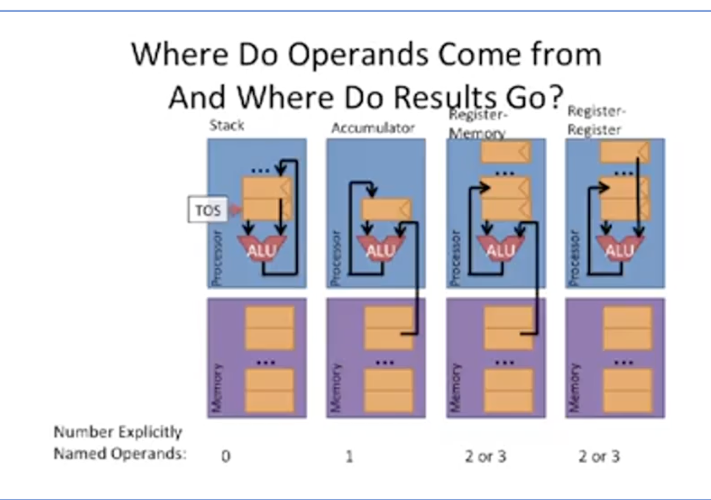
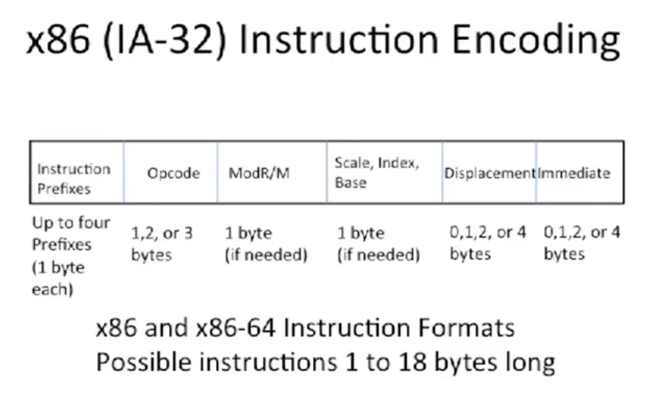

[Coursera](https://www.coursera.org/learn/comparch/lecture/rgQ8X/architecture-and-microarchitecture)

## Architecture vs Microarchitecture

Architecture / Instruction Set Architecture
- big A arch

Microarchitecture / Organization - implementation of the big A arch
- tradeoffs on how to implement ISA for some metrics
- examples: pipeline depth, # of pipelines, cache size, silicon area, peak power, execution ordering, bus width, ALU width etc

Machine Model
- where do operands come from and where do results go

Data Types
- Binary integer
- Binary coded decimal
- Floating point number
  - IEEE 754
  - Cary floating point (on Cary super computers)
  - Interl extended precision
- Packed vector data  
- Adresses
- They have different width

ISA encoding
- **fixed width** vs **variable length**
- fixed width: easy to decode, e.g `x86`
- variable length: takes less space in memory and caches
- other types
  - mostly fixed or compressed (only two width, 2 byte or 4 byte)
  - [Very] long instruction word: you can put multiple instructions into a fixed width bundle

